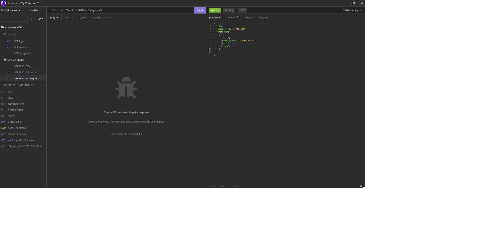
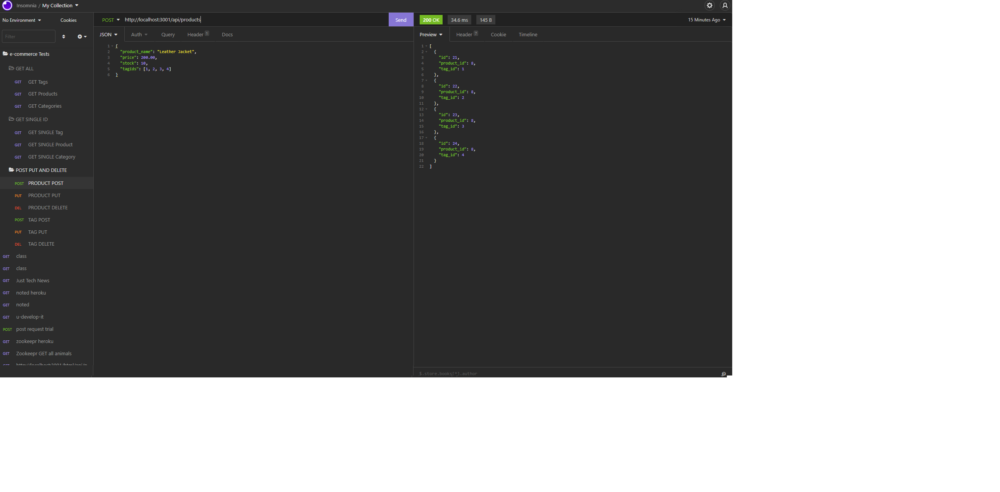

# E-commerce 

## Purpose
A Node.js application that uses sequelize and express to pull and create information in a database for the back end of an e-commerce website.

This project uses object relational mapping to modularize get, post, put, and delete routes in order to create the cleanest code we can to keep a highly functional application organized.

## Built With
* JavaScript
* Sequelize
* Express
* SQL

## Demonstration Video
[Demo](https://drive.google.com/file/d/1szctI7kF7ScoDsM_Fty7G555C4aJ2pqR/view)

## Examples

## Contribution
Reid Schroder